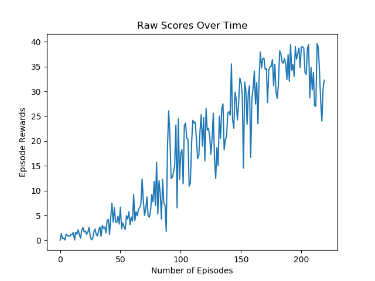
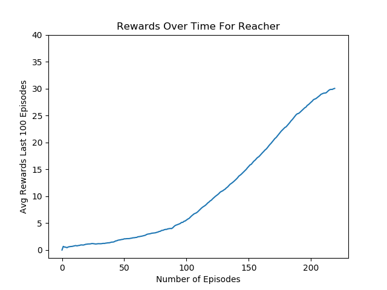

## Implementation of TD3 Algorithm

## The Algorithm

The Underlying model can be thought of as an improvement on the underlying DDPG algorithm similar to how Double DQN was able to improve on DQN models. In the [paper](https://arxiv.org/pdf/1802.09477.pdf), the authors explain how Actor Critic models suffer from over estimation similar to DQN models, and suggest using two critics instead of using only one like DDPG does to deal with this overestimation problem. 

After computing the values for the two critics we take the minimum of the two to force the algorithm to essentially underestimate the value of the state the agent is observing. This adds one more Critic to the algorithm compared to DDPG but I did not notice an increase in compute time of the algorithm.

The authors also suggest delaying on updating the actor of the model until the critic has learned to approximate well to avoid the cases where the update to the actor is done using incorrect value function. They suggest simply updating the actor after every N number of steps, and that's what I implemented in the model. This model was rather simple to implement over the DDPG algorithm, and in the paper the authors were able to achieve state of the art results, and this inspired me to use the algorithm over DDPG. 

## Neural Network Model

Both the Actor and the Critic for the algorithm has 2 hidden layers with 256 nodes in each hidden layer. Varying number of hidden layers and nodes were used to test if they would have made a big difference but the environments were solved rather quickly and I was not able to see a big difference in performance.

The policy updates were done after every 2 steps the agent took. I did not try other values for update frequency.

For measuring the error of value functions, MSE was used, and soft-updates were used to update the target models for the model

## Exploration

In the paper the authors used constant Gaussian noise injected into the model when selecting action to induce exploration. They mention how using a process such as Ornstein-Uhlenbeck process used commonly in DDPG does not seem to improve the convergence of  TD3 algorithm and Gaussian noise is quite a bit simpler to implement and understand compared to OU process. I used samples from Gaussian model with mean 0 and standard deviation of 0.1 to promote exploration and varying values of noise were tried but the environment was solved without any problems regardless. 

## Hyperparameters

* Number of Hidden Layer: 2 
* Number of Nodes : 256
* Batch Size : 128
* Discount Factor = 0.99
* Update Frequency = 2
* Soft Update Rate = 0.02
* Loss Function = MSE
* Gaussian STD = 0.1
* Policy Smoothing Sigma = 0.2
* Sigma Clipping = (-0.5, 0.5)

## Plots

Looking at the average score over 100 episodes, it appears that the agent solves the environment at around 220 episodes meaning that the agent was able to average 30+ scores from around episodes 120 to 220. This is quite remarkable given that I do not decrease the exploeration rate and give the model constant noise through training. 

In the [paper](https://arxiv.org/pdf/1802.09477.pdf), the authors suggest running the agent without any noise during training to gauge how well it has learned to solve the environments, and during training I gave no noise every 100 episodes

## Ideas For Future Work

PPO is an algorithm that improves on policy gradient methods such as REINFORCE, and it should be able to solve this environment as well. PPO re-uses some past experience to perform policy updates, which helps with the downside of on-policy method which is that it does not learn from past experiences. PPO can also be performed in parallel with multiple agents and given that this environment has a version that has 20 agents, PPO should be very well suited to solve it.  

1) PPO
